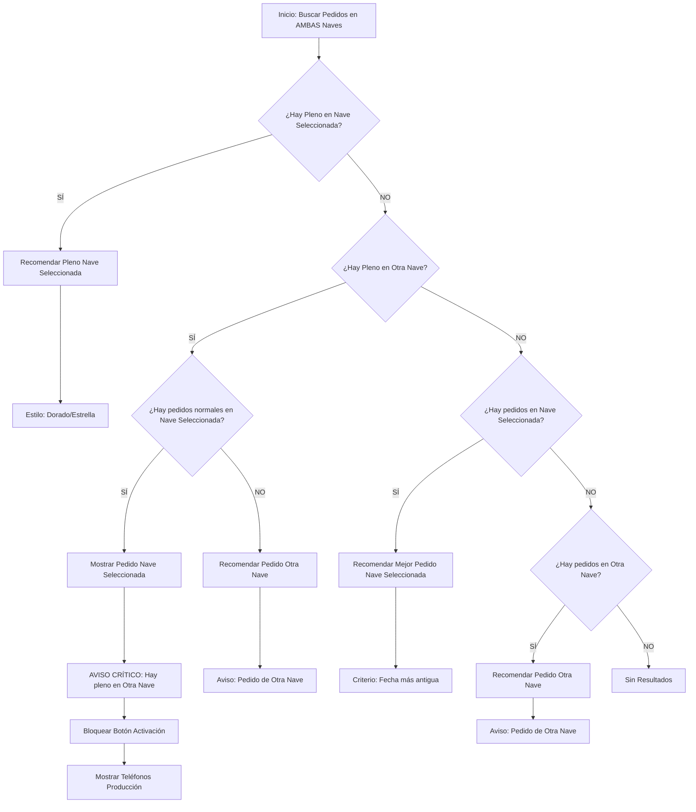

# Plan de Mejora: Lógica de Recomendación de Albaranes (Inteligente Multi-Nave)

Este documento detalla el análisis del funcionamiento actual y el diseño de la nueva lógica de recomendación solicitada para la recepción de albaranes, introduciendo priorización inteligente entre naves y fechas de entrega ("Plenos").

## 1. Funcionamiento Actual (AS-IS)

Actualmente, el sistema funciona con un filtrado estricto:

1.  **Entrada**: El usuario selecciona una Nave (ej. Nave A) en el formulario.
2.  **Búsqueda en BD**: El backend busca líneas de pedido pendientes.
3.  **Filtro Rígido**: Se aplica `WHERE obra_id = [Nave Seleccionada]`. **Se ignoran por completo los pedidos de la otra nave**, aunque sean idénticos o más urgentes.
4.  **Selección**: Entre los resultados de la nave seleccionada, se elige el que tiene la fecha de entrega más antigua.

**Problema**: Si el material llega a la Nave A, pero el pedido se hizo para la Nave B (o viceversa), el sistema dice "No se encontró pedido" o sugiere uno erróneo, ignorando el pedido correcto que está en la otra nave.

---

## 2. Nueva Lógica Propuesta (TO-BE)

El sistema pasará a buscar en **ambas naves** simultáneamente, pero aplicará un algoritmo de decisión jerárquico para sugerir la mejor opción, priorizando los "Plenos" (coincidencia de fecha exacta) y respetando la nave seleccionada cuando no hay errores evidentes.

### Conceptos Clave

- **Nave Seleccionada**: La nave que el operario marcó en el formulario (donde está físicamente descargando).
- **Otra Nave**: La nave opuesta.
- **Pleno (Golden Match)**: Un pedido cuya Fecha de Entrega está en el rango `[Hoy - 3 días, Hoy + 3 días]`. Es un indicador muy fuerte de que "este es el pedido que esperábamos hoy".

### Algoritmo de Decisión

El sistema evaluará todos los pedidos pendientes compatibles (mismo material/proveedor) de AMBAS naves y decidirá según este orden de prioridad:

#### Escenario A: Hay un "Pleno" en la Nave Seleccionada

_El pedido ideal está en la nave correcta y llega en fecha._

- **Acción**: Recomendar este pedido automáticamente.
- **Visualización**: Marcar como **pedido "Pleno"** (Icono Estrella / Borde Dorado).
- **Conflicto**: Incluso si hay un pleno en la Otra Nave, se ignora. La coincidencia de nave + fecha gana.

#### Escenario B: NO hay "Pleno" en Nave Seleccionada, pero SÍ en la Otra Nave

_El material parece pertenecer a la otra nave porque coincide la fecha perfectamente._

- **Acción**:
    - Si existen pedidos en la Nave Seleccionada (pero viejos o futuros):
        - Mostrarlos listados pero **BLOQUEAR LA ACTIVACIÓN**.
        - Mostrar **ALERTA CRÍTICA**: "¡Atención! Hay un pedido EXACTO para la OTRA NAVE".
        - **Protocolo de Escalado**: Mostrar teléfonos de Producción (ver sección siguiente).
        - Obligar al usuario a revisar si se ha equivocado de nave o si quiere forzar la recepción en esta.
    - Si NO hay pedidos en la Nave Seleccionada:
        - Recomendar directamente el pedido de la **Otra Nave**.
        - Mostrar aviso claro: "Este pedido pertenece a la [Otra Nave]".

#### Escenario C: NO hay "Plenos" en ninguna nave

_Ningún pedido coincide exactamente con la fecha de hoy._

- **Prioridad**: Gana siempre la **Nave Seleccionada** si tiene algún pedido (aunque sea antiguo o futuro).
- **Desempate**: Dentro de la nave seleccionada, gana el pedido con fecha de entrega más antigua.
- **Solo Fallback**: Si la Nave Seleccionada NO tiene ningún pedido, entonces (y solo entonces) se recomienda el de la Otra Nave con aviso informativo.

### Protocolo de Escalado: Contacto con Producción

Siempre que se detecte una alerta de tipo "Pedido de otra nave" (especialmente en Escenario B con bloqueo), el sistema debe facilitar la resolución del conflicto contactando a un superior.

- **Acción**: Mostrar una lista de contactos del departamento de **"Producción"**.
- **Datos a mostrar**: Nombre, Primer Apellido y Móvil de Empresa.
- **Formato**: Si no tiene móvil de empresa, mostrar un guion "-".
- **Origen de Datos**:
    1.  Buscar ID del departamento "Producción" en tabla `departamentos`.
    2.  Obtener usuarios vinculados en tabla intermedia `departamento_user`.
    3.  Extraer datos de la tabla `users`.

---

## 3. Diagrama de Flujo de Decisión



---

## 4. Cambios Técnicos Requeridos

### Backend (`AlbaranesScanController.php`)

1.  Modificar `generarSimulacion` para **remover el filtro `where('obra_id', ...)`**.
2.  Traer todos los candidatos de naves A y B.
3.  Implementar la lógica de clasificación descrita arriba en PHP.
4.  Devolver en la respuesta JSON:
    - `linea_propuesta`: El objeto del pedido ganador.
    - `tipo_recomendacion`: `pleno_nave_actual`, `pleno_otra_nave`, `normal_nave_actual`, `fallback_otra_nave`.
    - `alerta_conflicto`: Booleano o mensaje si se da el Escenario B (hay pleno en otra nave).
    - `bloquear_activacion`: Booleano si se requiere intervención manual fuerte.
    - `contactos_produccion`: Array de objetos `{ nombre: "Juan", apellido: "Perez", movil: "600..." }` (solo si hay conflicto).

5.  **Lógica Contactos Producción**:
    - Usar DB Facade o Modelo Departamento:
        ```php
        $contactos = DB::table('users')
            ->join('departamento_user', 'users.id', '=', 'departamento_user.user_id')
            ->join('departamentos', 'departamentos.id', '=', 'departamento_user.departamento_id')
            ->where('departamentos.nombre', 'Producción')
            ->where('users.estado', 'activo') // Opcional, si existe campo estado
            ->select('users.name', 'users.primer_apellido', 'users.movil_empresa')
            ->get();
        ```

### Frontend (`scan.blade.php`)

1.  Actualizar `poblarVista3ConPedido` para interpretar las nuevas flags.
2.  **Estilos**: Implementar clases CSS para el "Pleno" (dorado, estrellas).
3.  **Lógica UI**: Si `bloquear_activacion` es true:
    - Deshabilitar botón principal.
    - Mostrar Banner Rojo con la advertencia.
    - **Renderizar Lista de Teléfonos**: Crear un pequeño componente o `div` que itere sobre `contactos_produccion` y los muestre limpiamente.
    - Permitir desbloqueo manual (botón secundario "Entiendo el riesgo").

---

Este plan cubre todos los requisitos mencionados: priorización de naves, validación inteligente de fechas (plenos), gestión de errores de nave y protocolo de escalado con contactos de producción.
